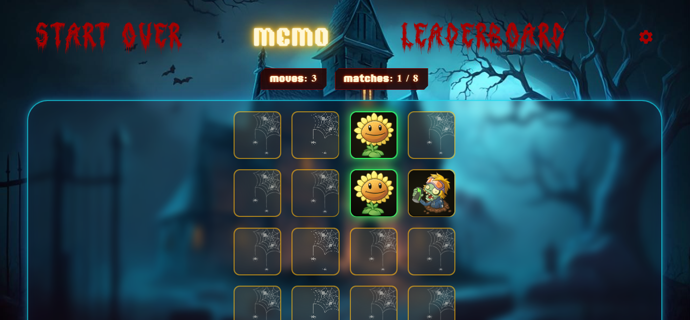
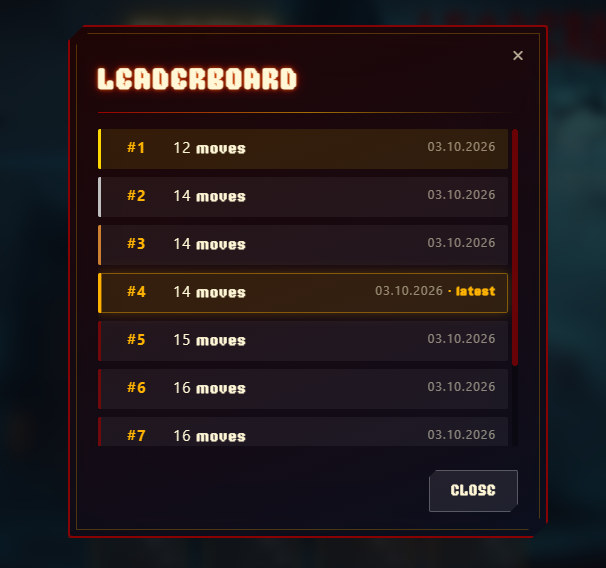
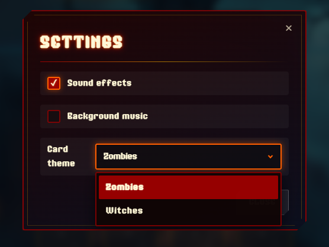
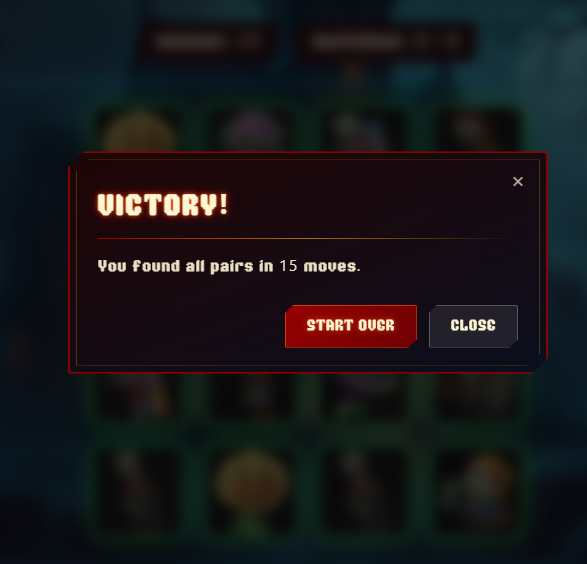

# Memory game

### Goal

Create a memory matching game — the player flips cards and memorizes their positions to find all the pairs in as few moves as possible.

---

### Task

[Rolling Scopes School — Memory Game](https://github.com/rolling-scopes-school/tasks/tree/master/tasks/memory-game)

---

### Demo

The game is deployed on GitHub Pages: [play now](https://daryadudkova98.github.io/memory-game/)

**Done:** 03.10.2026 / **Deadline:** 06.10.2026

---

### Screenshots






---

### Evaluation criteria

| Criterion | Points | Status |
|---|---|---|
| DOM generated via JavaScript | 15 | ✅ |
| 16 cards, 8 pairs, same card backs | 5 | ✅ |
| Game starts automatically on load | 5 | ✅ |
| Cards shuffled on each game | 5 | ✅ |
| Two cards opened in turn | 5 | ✅ |
| Matched pair stays open | 5 | ✅ |
| Repeated clicks ignored | 5 | ✅ |
| Non-matching pair closes in 700–1500 ms | 5 | ✅ |
| Blocking until pair closes | 5 | ✅ |
| Moves and matches counters | 5 | ✅ |
| Win modal with total moves | 5 | ✅ |
| Shared modal code | 5 | ✅ |
| Modals don't reset the game | 5 | ✅ |
| Leaderboard top-10 | 5 | ✅ |
| Scores saved to `localStorage` | 5 | ✅ |
| Both "New game" buttons reset the board | 10 | ✅ |
| Restart cancels the flip-back timer | 5 | ✅ |
| README with description and setup | 5 | ✅ |

**Total: 100 points for the app + 5 for README.**

---

### Skills Applied

- **Rendering:** generating all DOM elements with JavaScript (no static HTML in body).
- **Game logic:** splitting responsibilities across modules (`grid`, `deck`, `card`, `game`, `stats`).
- **State management:** syncing moves, matches, and board state via pub/sub in `stats.js`.
- **Data:** loading card themes from JSON, persisting selection and scores in `localStorage`.
- **Async:** deferred state updates with `setTimeout` for non-matching pairs.
- **UI:** custom modals (win, leaderboard, settings), 3D tilt effect, sound and music.

---

### Features

- 16 cards, 8 pairs, shuffled on each game
- Two themes: Zombies and Witches
- Sound effects and background music with mute toggles
- Live moves and matches counters
- Leaderboard with top-10 results stored in `localStorage`
- Settings modal: sound, music, theme picker
- 3D tilt effect on hover

---

### How to run

```bash
git clone https://github.com/daryadudkova98/memory-game.git
cd memory-game
# open index.html via Live Server or any local server
```

The game is also available online: [daryadudkova98.github.io/memory-game](https://daryadudkova98.github.io/memory-game/)